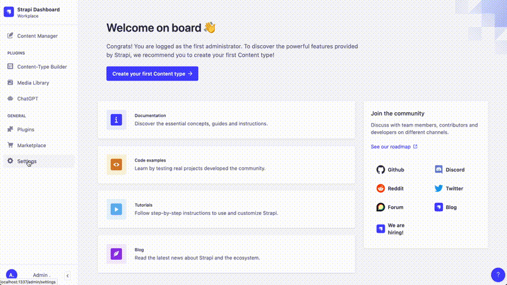

<div align="center">
   
</div>
<h1 align="center">ChatGPT Strapi Plugin</h1>
<p align="center">The ChatGPT Strapi Plugin is a plugin for the Strapi CMS that allows you to integrate the ChatGPT language model into your Strapi application.</p>

<p align="center">
 <!-- <a href="https://www.npmjs.com/package/strapi-chatgpt">

</a> -->
<!-- <a href="https://www.npmjs.org/package/strapi-chatgpt">
 -->
</a>
<a href="https://github.com/AsyncWeb/strapi-chatgpt/actions/workflows/eslint.yml/badge.svg">

</a>
<br />
<br />
<br />
 <br/>

<br/><br/>

</p>
<br>
<!-- # ChatGPT plugin for Strapi -->
<br/>

# ChatGPT plugin for Strapi

[OpenAI](https://openai.com/) ChatGPT is an AI chatbot auto-generative system created by Open AI for online customer care. It is a pre-trained generative chat, which makes use of (NLP) Natural Language Processing.

[Strapi](https://strapi.io/) is the leading open-source headless Content Management System. It’s 100% JavaScript, fully customizable and developer-first.

## Overview: Start using ChatGPT in your Strapi application

With this plugin, you can add ChatGPT-powered chatbots and other natural language processing functionality to your Strapi application with ease. The plugin provides a simple interface for configuring and deploying your ChatGPT models, as well as tools

Setting up the plugin is super easy and can be completed within 10 minutes.

1. Enter your OpenAI API credentials.
1. Select the model you want to use.
1. Optionally, you can configure the model's parameters.

Thats it! You can now use ChatGPT in your Strapi application.

## ✨ Features

1. **Easy to use**: The plugin is easy to use and can be set up within 10 minutes.
1. **Customizable**: You can customize the model's parameters to suit your needs.
1. **Open Source**: The plugin is open source and can be found on [GitHub]()

## 🖐 Requirements

1. [Node.js](https://nodejs.org/en/) version 14 or higher.
1. [Strapi](https://strapi.io/) version v4.x or higher.

> The CgatGPT plugin is designed for **Strapi v4.x**. It won't work with Strapi v3.x.

<br/><br/>

## ⏳ Installation

### 1. Install the plugin

<!-- use npm for installing plugin -->

```bash
npm install strapi-chatgpt
```

### 2. Enable the plugin

<!-- enable the plugin in the admin panel -->

Goto `<strapi app root>/config/plugins.js` Add the following code snippet.

```js
module.exports = ({ env }) => ({
  // ...
  "strapi-chatgpt": {
    enabled: true,
  },
});
```

### 3. Build and start the Admin UI

Afterwards, you would need to build a fresh package that includes the ChatGPT plugin. For it, please execute the commands below:

<!-- build the admin UI -->

```bash
npm run build
npm run develop
```

The ChatGPT plugin should appear in the Plugins section of the Strapi sidebar after you run the app again.

Now you are ready to integrate ChatGPT on your Strapi website 🎉
<br/><br/>

## 🔧 Configuration

You can easily configure the ChatGPT plugin in the Strapi admin panel.

- Goto `Settings` -> `ChatGPT -> Configuration` in the sidebar.
- On the configiration page, Enter All the fields.
- Click on Save to save the configuration.

<br/><br/>

## 📖 Testing the plugin

- Click ChatGPT plugin in plugin section of the sidebar.
- Click on Integration to get sample code integration code.
- Copy the code and paste it in your terminal.

<br/>

<br/>

## 📝 License

[MIT License](LICENSE.md)

Copyright © 2022 [AsyncWeb](https://higheredlab.com/)
